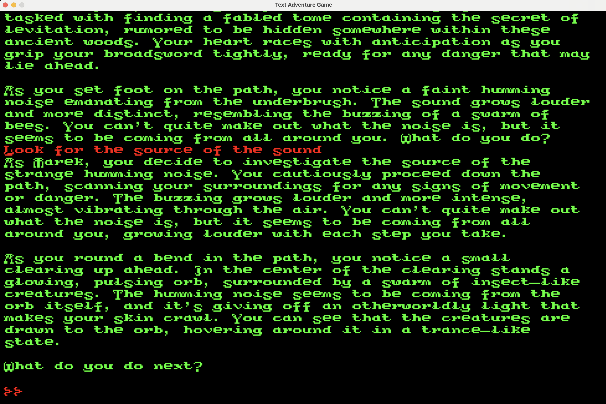

# AI based Text Adventure

This is companion code to my [article](https://medium.com/@robjsliwa_71070/crafting-retro-text-adventure-games-with-modern-ai-ab0d2fe6e2c6).  This repo implements a text adventure game that uses LLM by connecting to locally running Ollama server.  The game story can be defined using story card and player, companions, and other NPCs can be defined using character cards.  You can take a look at the `sample_story.yaml` for example.

Install required packages:

```bash
pip install -r requirements
```

To run the game in terminal start it with:

```bash
python game.py -s sample_story.yaml
```

or to run it in a window with retro styling:

```bash
 python gui_game.py -s sample_story.yaml
```

Here is the sample output from the game, in text mode:


and in graphical mode:


